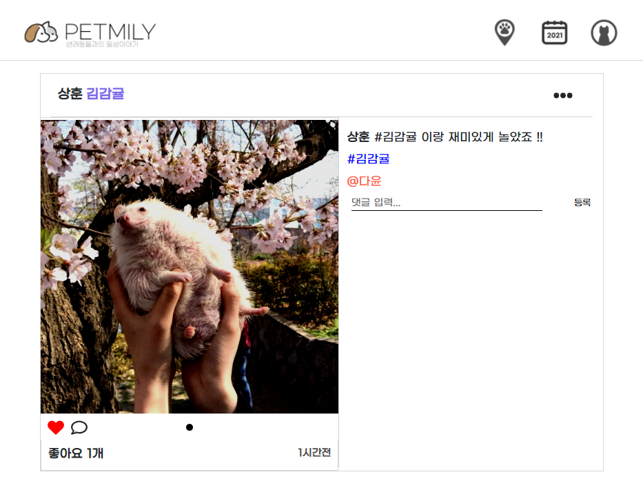
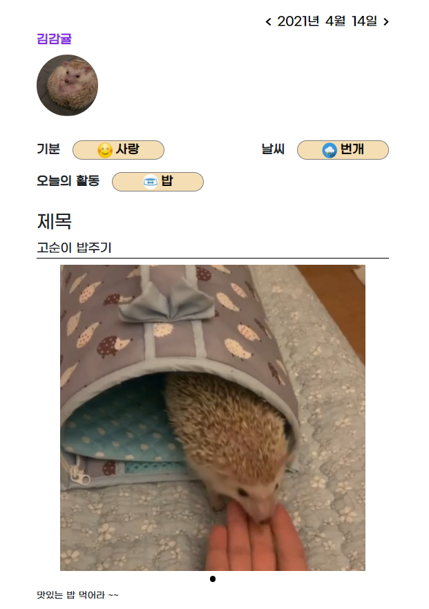
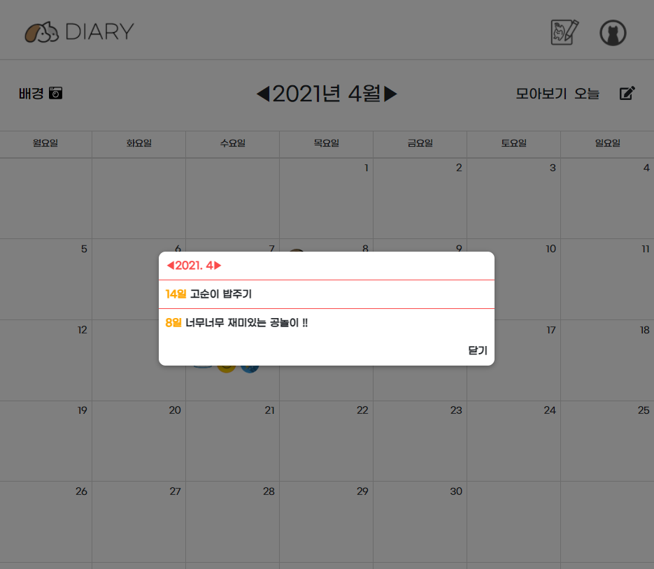

# Welcome to PETMILY


## Project Intro

- 진행 기간 : 2021.01.11 ~ 2021.02.19

- 목표 / 프로젝트 선정 배경

  - 나의 반려동물들을 한 계정에서 쉽게 관리 & 공유하고,
  - 다른 사람의 반려동물을 쉽게 구경하고,
  - 반려동물들의 일상을 한 눈에 파악할 수 있는 다이어리를 작성할 수 있는

  - 신개념 반려동물 전용 커뮤니티 만들기

- 웹 서비스 이름 : Petmily (펫밀리)

  - 반려동물과의 일상이야기, 신개념 반려동물 SNS 서비스


## Tech Stack

[](https://stackshare.io/sw0817/petmily)

<details>
    <summary>Front 자세히 살펴보기</summary>
    <ul>
        <li>Vue: 2.6.12</li>
        <li>Vue / CLI: 4.5.8</li>
        <li>Vuex: 3.4.0</li>
        <li>npm: 6.14.10</li>
        <li>axios: 0.21.1</li>
    </ul>
</details>

<details>
    <summary>Back 자세히 살펴보기</summary>
    <ul>
        <li>Swagger</li>
        <li>Spring Boot</li>
        <li>Spring Security</li>
        <li>MySQL</li>
        <li>NGINX</li>
        <li>EC2</li>
    </ul>
</details>

<details>
    <summary>ETC 자세히 살펴보기</summary>
    <ul>
        <li>Json Web Token</li>
        <li>GitLab</li>
        <li>Jira</li>
        <li>Webex</li>
    </ul>
</details>


## ⚙️ Install and Usage

### Frontend

- frontend 폴더로 들어와 필요한 패키지를 설치합니다.

  - ```bash
    $ npm i
    ```

- frontend 폴더 (vue 프로젝트)를 실행합니다.

  - ```bash
    $ npm run serve
    ```

### Backend

- Java (Open JDK 14)를 설치합니다.
- Maven을 설치합니다.
- VS Code 및 관련 Spring Boot Extension Pack 설치합니다.

- DB 테이블을 생성합니다.


## ⭐️ 주요 기능

### Feed


> Petmily의 피드에는 작성자의 닉네임, 게시글에 태그한 펫, 사진 및 동영상, 좋아요, 작성시간, 글 내용, 태그, 친구언급과 댓글이 표시됩니다. 게시물 우측 상단 버튼을 클릭해 수정, 삭제, 게시물로 이동, 혹은 게시글 신고를 할 수 있습니다.


- 게시글 상세페이지

  

  - 게시글 상세페이지는 게시글의 정보를 한 눈에 확인할 수 있는 레이아웃을 사용했습니다. 모바일 버전에서는 피드페이지와 같은 세로형 레이아웃으로 나타납니다.

  

- 게시글 작성

  

  - 피드페이지 우측 하단 글 작성 버튼을 클릭해, 피드 게시글을 작성할 수 있습니다.

  

  
  
  - 우측 상단 발자국 버튼을 클릭해, 등록한 동물을 태그할 수 있습니다.
- 펫 사진 우측 펫 이름을 클릭해 태그를 할 수 있고, 태그된 펫 창에서 X버튼으로 취소할 수 있습니다.
  - 태그된 펫은 게시글 작성 레이아웃 좌측 상단에 업데이트됩니다.

  
  
  
  
  - 우측 상단 사진기 버튼을 클릭해 사진과 동영상을 최대 10장 등록할 수 있습니다.
    - 사진 및 동영상은 정사각형 형태로 등록되며, 이 때 기존 사진의 가로와 세로길이 중 짧은 길이를 선택해 긴 방향의 중앙 부분이 나타납니다.
  - 등록한 사진 및 동영상은 레이아웃 좌측에 표시되며, 표시된 사진 하단 필터링 필름을 선택해 다양한 필터를 입힐 수 있습니다.
  - 레이아웃 우측에서 게시글의 내용을 작성할 수 있습니다. 작성 중 키보드의 #키를 통해 태그를 입력할 수 있으며, @키를 입력해 펫 태그와 같은 모달창을 띄워 친구를 언급할 수 있습니다. 언급된 친구는 X버튼으로 취소할 수 있습니다.
  
  
  
- 피드 목록 필터링

  

  - 네비게이션 바 중앙의 사람 아이콘을 클릭해, 피드 보기 모드를 바꿀 수 있습니다.
  - 전체 사용자의 피드를 모두 보거나, 내가 팔로잉하고 있는 사용자의 피드만 볼 수 있습니다.

  

- 유저 및 태그 검색

  

  

  - 네비게이션 바 중앙 검색 아이콘을 클릭해, 유저 및 태그 검색을 할 수 있습니다.
  - 사용자의 닉네임의 일부를 입력해, 친구를 찾아 해당 유저의 프로필 페이지로 이동할 수 있습니다.
  - 등록된 게시글 태그의 일부를 검색해, 해당 단어가 포함된 태그를 가진 게시물의 갯수를 확인할 수 있고, 검색된 태그를 클릭해 해당 태그를 가진 게시물만 피드 페이지에서 모아볼 수 있습니다.
    - 이 때, 팔로우 한 사용자 게시물 모아보기 필터링도 중복하여 사용할 수 있습니다.


### Profile


> 프로필 페이지에서는 개인정보 및 게시물, 팔로워, 팔로우 정보, 등록된 반려동물 정보 및 등록한 게시글을 확인할 수 있습니다.


- 나의 반려동물 등록

  

  - 게시글에 펫을 태그하려면, 먼저 마이 프로필에서 펫을 등록해야합니다.
  - 프로필 페이지의 나의 반려동물 우측 + 버튼을 클릭해, 펫을 등록할 수 있습니다.
  - 펫 사진, 이름, 종류, 생일, 성별 및 간단한 소개글을 작성할 수 있습니다.
  - 펫은 최대 3마리까지 등록이 가능합니다.

  

- 개별 펫 관리

  

  - 프로필 페이지의 나의 반려동물 탭에서 좌우 방향 화살표를 클릭해 등록한 개별 펫 관리를 할 수 있습니다.
  - 초기 페이지에서는 등록한 모든 펫의 사진과 게시글을 확인할 수 있고, 오른쪽으로 페이지를 넘겨 등록한 각각의 펫의 상세 정보 및 해당 펫이 태그된 게시글만 모아볼 수 있습니다.
    - 펫 이름 옆 톱니바퀴 버튼을 클릭해 펫 정보를 수정하거나, 펫 등록을 해제할 수 있습니다.
  - 게시글 사진을 클릭해, 해당 게시글 상세보기 페이지로 이동할 수 있습니다.
    - 게시글 사진에 마우스를 올리면 좋아요의 갯수가 표시됩니다.


### Diary


> Petmily는 유저 개인만의 다이어리 서비스를 제공합니다. 네비게이션 바의 달력 아이콘을 클릭해 다이어리 페이지로 이동할 수 있습니다. 
>
> 자신만의 다이어리 표지 사진을 등록하고, 날짜별로 펫과 그 날의 활동을 다이어리에 작성하면, 표지 달력에 해당 스티커가 표시되어 어떤 펫과 어떤 활동을 어떤 빈도로 했는지 쉽게 확인할 수 있습니다.


- 다이어리 작성

  

  - 다이어리 페이지의 글 작성 아이콘을 클릭하거나 달력에 표시된 날짜를 클릭해, 다이어리를 작성할 수 있습니다.
    - 글 작성 아이콘을 클릭하면 오늘 날짜를 기본으로, 달력의 표시된 날짜를 클릭하면 해당 날짜를 기본으로 다이어리를 작성합니다.
  - 등록된 펫 중 어떤 펫의 이야기인지 선택하고, 기분, 날씨, 활동 등을 선택할 수 있습니다.
    - 다이어리를 작성하고 싶은 날짜를 변경할 수도 있습니다.
  - 사진이나 동영상을 한 장 등록할 수 있습니다.
  - 제목과 다이어리 내용을 작성해 저장할 수 있습니다.


  

  - 기분, 날씨, 활동은 모달 창에서 해당하는 스티커와 함께 선택할 수 있습니다.


  

  - 다이어리가 등록되어 선택한 펫, 활동, 기분, 날씨가 달력에 스티커로 표시된 것을 확인할 수 있습니다.
    - 오늘 날짜는 달력에 빨간색 숫자로 표시됩니다.


  

  - 스티커를 클릭해, 등록된 다이어리를 확인할 수 있습니다.


- 다이어리 월별 모아보기

  

  - 우측 상단 모아보기 버튼을 클릭해, 다이어리를 월별로 모아볼 수 있습니다.
  - 제목을 클릭해 해당 다이어리 상세 페이지로 이동할 수 있습니다.


- 다이어리 배경사진 등록

  

  - 좌측 상단 배경 버튼을 클릭해, 나만의 다이어리 배경사진을 등록할 수 있습니다.


### Pet Convenient Facilities


> 피드 페이지 네비게이션의 위치 아이콘을 클릭해, 반려동물 편의시설을 현재 위치 기반으로 빠르게 찾아볼 수 있습니다. 현재 구현되어있는 검색 편의시설은 동물병원, 애견카페, 애견호텔 등입니다.


- 정보 탭 숨기기

  

  - 좌측 리스트 탭의 리스트 숨기기 버튼, 상단 편의시설 목록의 핀 버튼을 클릭해 정보를 숨겨 지도를 더욱 보기 쉽게 확인할 수 있습니다.


### Chat


> Petmily는 실시간 채팅 기능을 제공합니다.


- 채팅 목록

  

  - 피드 페이지 네비게이션 바의 프로필 아이콘을 클릭해, 메시지 기능을 사용할 수 있습니다.
  - 메시지 버튼을 클릭해 대화 목록을 확인할 수 있고, 아직 확인하지 않은 메시지가 있는 대화방에는 빨간색 점으로 표시됩니다.


### Notification


> Petmily는 실시간 알림 기능을 제공합니다. 네비게이션 바 프로필 아이콘에 확인하지 않은 알림이 생긴다면 실시간으로 빨간색 점이 표시됩니다.
>
> 아이콘을 클릭시, 게시글에 태그되거나 나의 게시글에 좋아요 및 댓글이 등록되면 내 알림으로, 메시지를 받으면 메시지에 알림 갯수가 실시간으로 표시됩니다.


### ETC

> Petmily의 모든 페이지는 PC 및 모바일 환경을 고려하여 반응형 페이지로 제작되었습니다.

> 모든 모달 알림창 활성화시, 모달창의 바깥쪽을 클릭해 모달창을 비활성화 시킬 수 있습니다.

> 회원가입시 이메일 인증기능을 사용하였습니다.

> 더 자세한 내용은 [Petmily_시연영상](https://www.youtube.com/watch?v=b6qmTilhApQ) 을 통해 확인할 수 있습니다.

> 이 프로젝트는 삼성청년 SW 아카데미 4기 웹 프로젝트 부문 서울 지역 우수프로젝트로 선정되었습니다.


## 👨‍👩‍👦 Team members

### 신상훈(Shin Sanghun)

> [@github](https://github.com/sw0817)

- Team Leader
- Frontend
- Presentation

### 신윤식(Shin Yoonsik)

> [@github](https://github.com/)

- Backend
- Server

### 이도건(Lee Dogun)

> [@github](https://github.com/)

- Frontend
- UCC

### 박다윤(Park Dayoon)

> [@github](https://github.com/)

- Backend
- Database

### 박서영(Park Suyoung)

> [@github](https://github.com/)

- Backend
- Frontend


## 배포

> 펫밀리 (PETMILY) 웹사이트

🏠 [Homepage](https://i4a403.p.ssafy.io/)

AWS(EC2) 서버에 배포하였다.


## 호환성

- 크롬(Chrome) & 안드로이드 완벽 구동
- IE 구동 불가능
- iOS 이미지(로고) 크기가 변경되는 버그
- iOS에서 실행 시 일대일 대화 시간이 NaN으로 나오는 문제


## 알려진 버그

**☑️** 가로크기 1100px 이상에서 피드 작성 시, 사진에 특정 필터링 적용 시 사진 크기가 늘어나는 버그

**☑️** 피드 작성에서 동영상 업로드 시, 필터링 Preview 사진이 작은 네모칸으로 출력되는 버그

**☑️** 피드 태그 및 댓글 알람 모두지우기 실행 시, 해당 알람 내용이 다시 나타나는 버그


##### *Copyright* © 2021 SSAFY 4기 Team PETMILY
